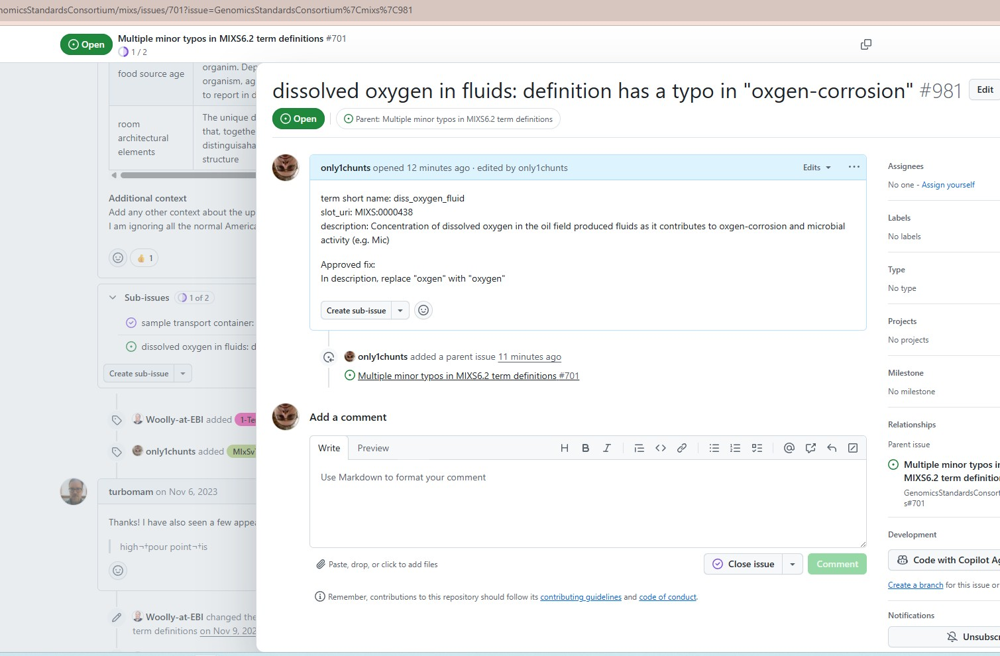

## Introduction

This is a post to show you how to make a simple* update to the MiXS source of truth YAML file.

*- by simple we're talking about things that effect only a single term like correcting a typo or updating the term definition, or even adding an example value.

The principles described here will hold for larger more complex updates, but there will be additional technical considerations for those sort of updates so we'll deal with those in another tutorial.

## Workflow

The general workflow of making an update is:
1 - an "issue" is reported to the GSC by submitting a issue ticket describing the issue with a clear and succinct definition of what is required to complete the issue. see tutorial on creating good GitHub issue tickets (to be created!)

2 - The CIG and/or TWG group will assess the ticket content and request any additional information required to ensure clarity and understanding

3 - An appropriate solution is proposed in the ticket by the community, the original ticket maybe broken down into smaller tasks if required.

4 - The solution(s) is agreed and/or approved by the CIG for fixing in MiXS

5 - Anyone with suitable skill set makes a branch from the ticket/sub-tickets to implement the approved fixing, and completes the work to the point of making a Pull Request(PR) in the GitHub repo for the new branch.

6 - TWG members review the PR and merge when saticifed its all OK

**This document should enable anyone with a GitHub account to perform step 5 for simple updates.**

## Using GitHub web interface

You will require a valid [GitHub account](https://github.com/signup) to perform any of these tasks.

## Worked example

Ticket [#701](https://github.com/GenomicsStandardsConsortium/mixs/issues/701) was provided by a user, it included a bunch of typo's in various term descriptions. We will use this as an example use case for making simple updates.

The ticket 701 combines a number of different tasks, so the first thing we need to do is split out a single task to work on. 
See screenshot:

Create the subissue as shown above.
Note the line item disappears from view and gets inserted further down the ticket so scroll down to find the newly created sub-issue: 

Then we need to edit the sub-issue description to include all the details of exactly what needs to be changed: 

As a guide the ticket should include the specific term ID and the exact changes that have been proposed and approved by the CIG. Also note that the sub-issue has automatically had the Parent ticket linked in the relationship field on the right of the screen: 

Make a mental note of the sub-issue ticket number, in this example its #981
Navigate to the source of truth mixs.yaml file where the update needs to be made: 
Next we need to edit the mixs.yaml file, to do this you may need to be a member of the GSC GitHub group, if you do not see the icon as shown please contact the GSC to request to be added to the GitHub group: 

Use the "Find" function (in Windows thats "Ctrl+F") to search the document to find the typographic error that we're updating. In this case its the word "oxgen", and it only appears once in the document. Be particularly careful to make sure that you find the exact place in the document that is approved for update in the ticket you are working on. 
If you discover additional issues it is safest to make a note of those and create separate tickets for additional future updates so that they can be examined and approved by the CIG before being made.
ONLY proceed with the update that is approved in the ticket you are working towards: 

After you have made the relevant update to the file, click the "Commit changes" button

In the pop-up dialog box called "Proposed changes" you need to fill in the details of what the commit is about, this should include the issue number being fixed and the description of what the fix is: 

