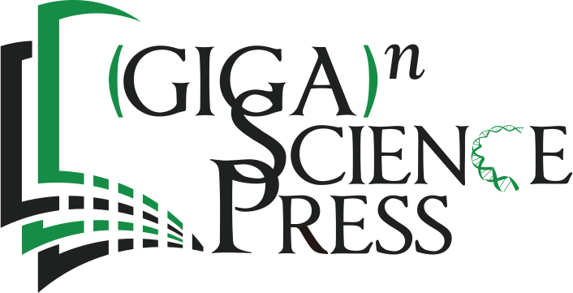
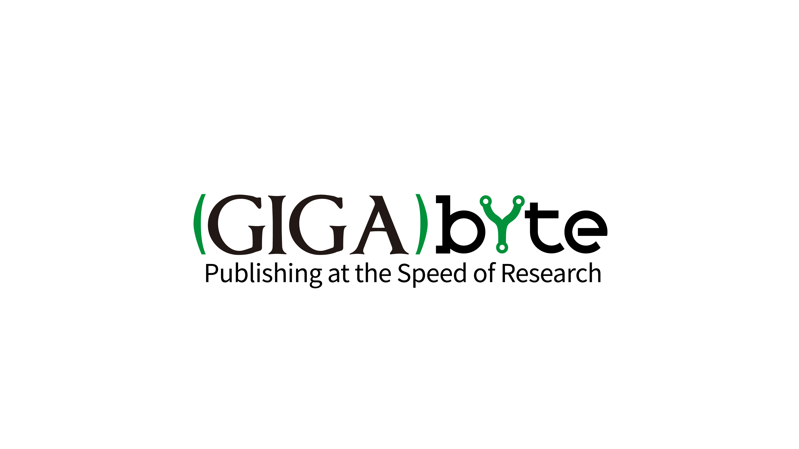

# [About GigaScience Press](https://www.gigasciencepress.org/)

GigaScience Press has the goal of achieving true open science by embracing the UNESCO Open Science Recommendation as the primary goal for its publications and activities. The Press publishes award winning Open Science journals, which all have the goal of making scientific communication reach researchers and communities around the globe. The Press also runs a data publishing platform (GigaDB) with an in-house data curation team to link published articles with data and other research objects, helping support reproducibility, reusability and the FAIR principles of data stewardship.

## About GigaScience Journal

<i>(GigaScience)[http://gigasciencejournal.com/]</i> is GigaScience Press’ and OUP’s flagship Open Science journal, leading the way in moving scientific communication beyond Open Access. Our in-house Editorial and Curation teams provide a single unified service to make published research and all of the supporting data, code, and methods open and stably shared. Built upon the principles of open and FAIR data (Findable, Accessible, Interoperable and Reusable); reproducibility, usability and utility are our key criteria for publication. Our team aids authors in making sure their published work matches the latest global standards and policies, providing the scientific community with one of the best means to speed scientific progress.

## About GigaByte Journal

<i>(GigaByte)[https://gigabytejournal.com/]</i> aims to promote the most rapid exchange of scientific information in a formal peer-reviewed publishing platform. Modern research is data-driven, iterative, and aims to be FAIR: Findable, Accessible, Interoperable and Reusable. It is also fast moving, with available data and computational tools changing constantly and swiftly evolving fields continuously being tested, updated and modified by the community. GigaByte provides scientists a venue to rapidly and easily share and build upon each other’s research outputs publishing short, focused, data-driven articles using a publishing platform that allows nearly immediate online publication on acceptance.

## About GigaDB

<i>(GigaDB)[http://gigadb.org]</i> is a data repository supporting scientific publications in the Life/Biomedical Sciences domain. GigaDB works with authors to organize and curate data from individually publishable units into datasets, which are provided openly and in as FAIR manner as possible for the global research community. Through our association with (DataCite)[http://www.datacite.org/], each dataset in GigaDB will be assigned a (DOI)[http://www.doi.org/] that can be used as a standard citation for future use of these data in other articles by the authors and other researchers. To maximize its utility to the research community, the datasets in GigaDB are placed under a (CC0 waiver)[http://creativecommons.org/publicdomain/zero/1.0/]. 

